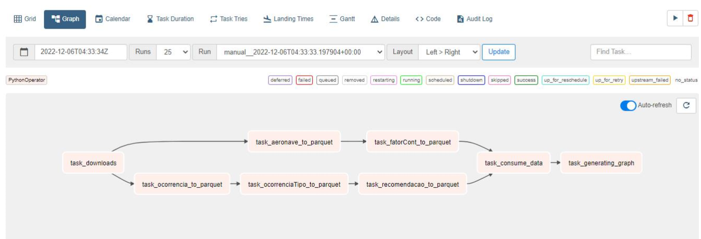

## Data Pipeline Desenvolvido usando Airflow, Python e Astronomer.
 

### Olá!!! 👋

Esse repositório contém um projeto que desenvolvi para estudar a implementação do Apache Airflow e uso do Python em ETL. 

 

### Objetivo
Implementar uma pipeline de dados usando apahce Airflow e Pythom. Para aprofundar os estudos em desenvolvimentos utilizando estas técnologias.

* Os dados utilizados nesse projeto são do Cenipa, extraidos pelo Portal Brasileiro de Dados Abertos https://dados.gov.br/home.
* No projeto a ingestão de dados é automática, por meio de um scraping efetuando o download dos arquivos usando a função retrieve() do Python.  
* O tratamento dos dados é realizado usando Python com Pandas.

* Estrurada uma infrasturura de pastas: raw, stage e consumer.

* Utilizado o Astro (https://www.astronomer.io/) para gerenciamento e desenvolvimento no Airflow.

### 🛠️ Tecnologias
    

***
 

## 📌 Visualização
 

### Graph

 

Astro Overview
========

Welcome to Astronomer! This project was generated after you ran 'astro dev init' using the Astronomer CLI. This readme describes the contents of the project, as well as how to run Apache Airflow on your local machine.
##### (Astronomer documentation: https://docs.astronomer.io/)
 

Project Contents
================

Your Astro project contains the following files and folders:

- dags: This folder contains the Python files for your Airflow DAGs. By default, this directory includes an example DAG that runs every 30 minutes and simply prints the current date. It also includes an empty 'my_custom_function' that you can fill out to execute Python code.
- Dockerfile: This file contains a versioned Astro Runtime Docker image that provides a differentiated Airflow experience. If you want to execute other commands or overrides at runtime, specify them here.
- include: This folder contains any additional files that you want to include as part of your project. It is empty by default.
- packages.txt: Install OS-level packages needed for your project by adding them to this file. It is empty by default.
- requirements.txt: Install Python packages needed for your project by adding them to this file. It is empty by default.
- plugins: Add custom or community plugins for your project to this file. It is empty by default.
- airflow_settings.yaml: Use this local-only file to specify Airflow Connections, Variables, and Pools instead of entering them in the Airflow UI as you develop DAGs in this project.

Deploy Your Project Locally
===========================

1. Start Airflow on your local machine by running 'astro dev start'.

This command will spin up 3 Docker containers on your machine, each for a different Airflow component:

- Postgres: Airflow's Metadata Database
- Webserver: The Airflow component responsible for rendering the Airflow UI
- Scheduler: The Airflow component responsible for monitoring and triggering tasks

2. Verify that all 3 Docker containers were created by running 'docker ps'.

Note: Running 'astro dev start' will start your project with the Airflow Webserver exposed at port 8080 and Postgres exposed at port 5432. If you already have either of those ports allocated, you can either stop your existing Docker containers or change the port.

3. Access the Airflow UI for your local Airflow project. To do so, go to http://localhost:8080/ and log in with 'admin' for both your Username and Password.

You should also be able to access your Postgres Database at 'localhost:5432/postgres'.

Deploy Your Project to Astronomer
=================================

If you have an Astronomer account, pushing code to a Deployment on Astronomer is simple. For deploying instructions, refer to Astronomer documentation: https://docs.astronomer.io/cloud/deploy-code/

Contact
=======

The Astronomer CLI is maintained with love by the Astronomer team. To report a bug or suggest a change, reach out to our support team: https://support.astronomer.io/